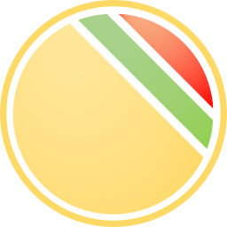
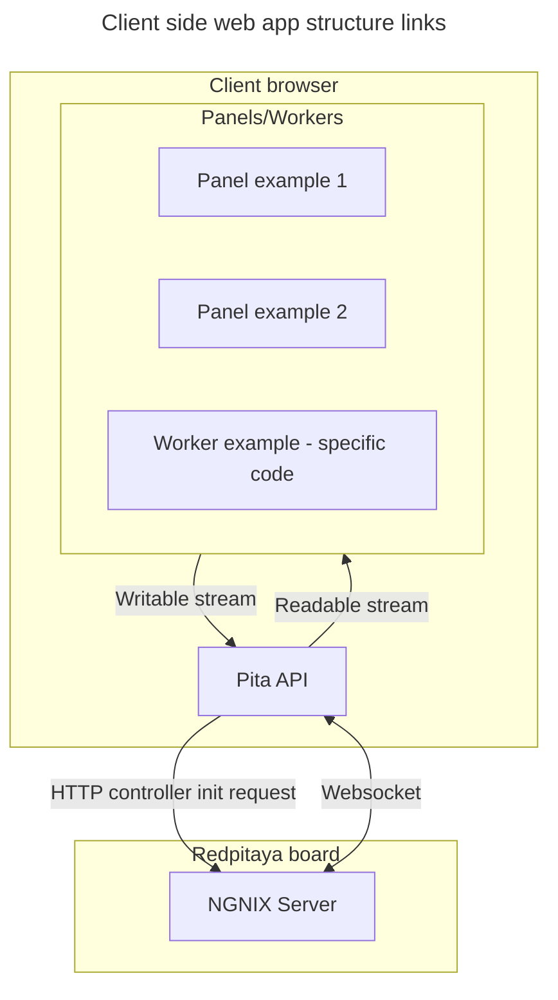
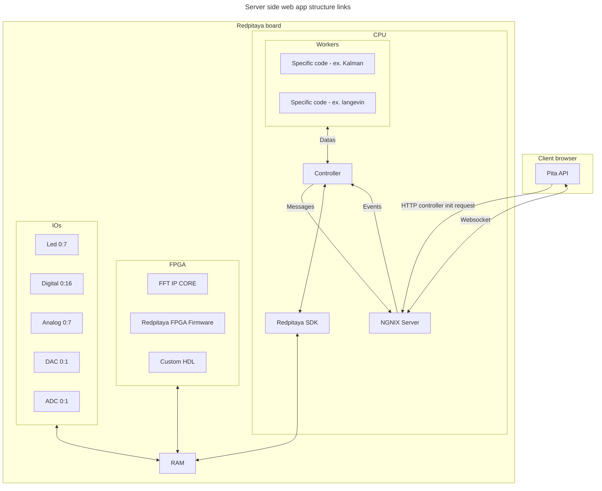
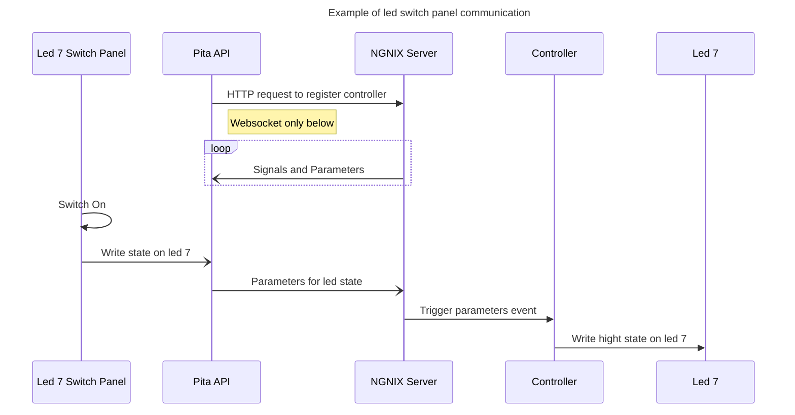

<div align="center">
    
    <h1>Pita template</h1>
    <p>Simpliest way to develop secure and powerful webapps for redpitaya.</p>
</div>


Simpliest way to develop secure and powerful app for redpitaya.

Pita 🫓 template to scaffold and manage webapp for
[redpitaya](https://redpitaya.com/). Pita allows you to code, build and
implement your webapp with a robust and secure environement. It handle all your
workflow, from tooling installation to testing, benching and publishing.

Project are customizable, by default:

- frontend is in typescript/tsx
- backend is in rust
- fpga is in verilog

All app is builded in www/ and sended to repitaya board.

## Getting started

Use pita cli or tasks described in [deno.jsonc](./deno.jsonc)

### With [Pita cli](https://github.com/JOTSR/pita-cli):

1. Only once, ensure tools and workflow configuration.
   ```sh
   pita requirements --check
   ```
2. Init a new project.
   ```sh
   pita init
   ```
3. Build sources and implement it on the board.
   ```sh
   pita run
   ```

### Without Pita cli

1. Check tools.
   1. Required: deno, rustup, vivado, ssh, scp.
   2. Recommanded: vscode, git.
2. Clone this repositor.
3. Edit [.pita/project.json](.pita/project.json) with your host configuration
   and a new valid uuid.
4. Build sources.
   ```sh
   deno task build
   ```
5. Connect to your board and enable write access.
   ```sh
   root@rp-XXXX: rw
   ```
6. Optionnaly copy your ssh credentials to avoid password.
7. Implement build on board.
   ```sh
   deno task implement
   ```
8. Open redpitaya app menu on your browser and test your webapp.

## Structure

<pre>
.
├── <span style="color: royalblue">🔵 backend</span> <span style="color: grey">(interface between client and redpitaya fpga/cpu)</span>
├── <span style="color: goldenrod">🟡 deno.jsonc</span> <span style="color: grey">(tasks)</span>
├── <span style="color: royalblue">🔵 fpga</span> <span style="color: grey">(???? bitstream - fpga project structure)</span>
├── <span style="color: royalblue">🔵 frontend</span> <span style="color: grey">(client-size application)</span>
│   ├── <span style="color: tomato">🔴 app.tsx</span> <span style="color: grey">(app entry-point)</span>
│   ├── <span style="color: royalblue">🔵 components</span> <span style="color: grey">(component lib for building your own panels)</span>
│   └── <span style="color: royalblue">🔵 panels</span> <span style="color: grey">(control panels to monitor and pilot board IOs and state)</span>
├── <span style="color: goldenrod">🟡 import_map.json</span> <span style="color: grey">(js path resolution)</span>
└── <span style="color: royalblue">🔵 www</span> <span style="color: grey">(dist app folder)</span>
    ├── <span style="color: royalblue">🔵 bin</span> <span style="color: grey">(temp c++ backend interface)</span>
    ├── <span style="color: goldenrod">🟡 fpga.*</span> <span style="color: grey">(fpga bitstream loading)</span>
    ├── <span style="color: tomato">🔴 index.html</span> <span style="color: grey">(server-side app entry point)</span>
    ├── <span style="color: royalblue">🔵 info</span>
    │   ├── <span style="color: forestgreen">🟢 favicon.png</span> <span style="color: grey">(browser icon)</span>
    │   ├── <span style="color: forestgreen">🟢 icon.png</span> <span style="color: grey">(redpitaya menu icon)</span>
    │   └── <span style="color: goldenrod">🟡 info.json</span> <span style="color: grey">(app info, do not manually edit version and revision)</span>
    └── <span style="color: royalblue">🔵 src</span> <span style="color: grey">(build assets, do not edit)</span>

<span style="color: royalblue">🔵 directory</span>
<span style="color: tomato">🔴 entrypoint</span>
<span style="color: forestgreen">🟢 assets</span>
<span style="color: goldenrod">🟡 config</span>
</pre>

## Operating diagrams







## Contributing

Read [CONTRIBUTING](./CONTRIBUTING.md) and start a codespace or clone this
repository.

Folow conventionnal commit, document your code and, use deno or rust style
coventions on the corresponding directories.

Link your PR with the corresponding issue if it exists.
